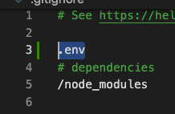

# **API STUFF - DAY ONE!**
  
##### _this doc is subject to change...it's only DAY ONE..._
---
## An API is like a database...except someone else did all the work. Thanks, someone else!
---
## Here's a link or three:
https://any-api.com/  
https://github.com/public-apis/public-apis  
https://catalog.data.gov  
https://www.programmableweb.com/apis/directory  

### **TERMS!!** 

- "apiKey" = yes!
- "OAuth" = no...for now.
- "HTTPS" = yes!
---
 

# ***LET'S PARTY!***

## - _fork as usual_
## - _clone as usual_
 

        npm install

### - Open TWO terminal tabs and run each of these (keep them running):

        npm run server

        npm run client

---

1. ## Create this file in the ROOT of your project in VSC:

 

 

#### _…your API keys are going to go in here_
 

2. ## Inside your .gitignore, type: :
 

## And this goes in your .env file (with whatever API key(s) you’re using)
 

 

#### _…this is so your project won’t push your secret stash of secrets to GitHub (GitHub scans for this stuff and will blow up your car if you screw this up)_
 

3. ## Then, in project folder in terminal:

        npm install dotenv
        

4. ## IN SERVER.JS:
 

#### _…this is a template of what you must add. That “require” line is to let your project know that is there, and the express route will be for what you’re working on. Might be a router instead ¯\_(シ)_/¯_
 

#### _Client makes request from server, server makes request from router if applicable, router makes request from “your database” which, in this case, happens to be your API (Giphy for now)…then the “database” sends info back through that path back up to the client!_ 

 

5. ## Type an axios request and type in your necessary crap like this ON SERVER SIDE (cuz it’s a secret…no client side)…in this case, it’s in my router:

 

#### _…check out the top there, too. You aren’t IMPORTING Axios…you’re requiring it._

#### _Also, for good measure, here’s the SERVER file (simple enough:)_
 
 
 

6. ## Now the CLIENT SIDE…

  

## The resulting data is going to be wild (console):

 
 

## You can plug {JSON.stringify(result)} into your render section and see something like this:

 

7. ## Unfold the stuff in the console. Look at it. Look for image attributes and URLs and stuff. Remember the path. It’s like a property of an object…
 

#### _…Look closely. Image tags! Perhaps we could use:_

 

8. ## NOW…LET’S RENDER!!
 

### _…In this case, we saved .data.data.iamge_origin_url (which translated to an image path, complete with quotes!!) to the above._
 

## You'll see a BUNCH of versions of the gif...even videos, thumbnails, all kinds of stuff to pick from. Just treat it like nested object properties.

9. ## THE FINAL APP.JS PAGE IN ALL ITS GLORY…
 

## I hope this helps make sense of how this stuff works. Do your reading and research, consult the API documentation, figure out the endpoints...MASTER each API you want to use.
 

# ...and don't forget to HAVE FUN

