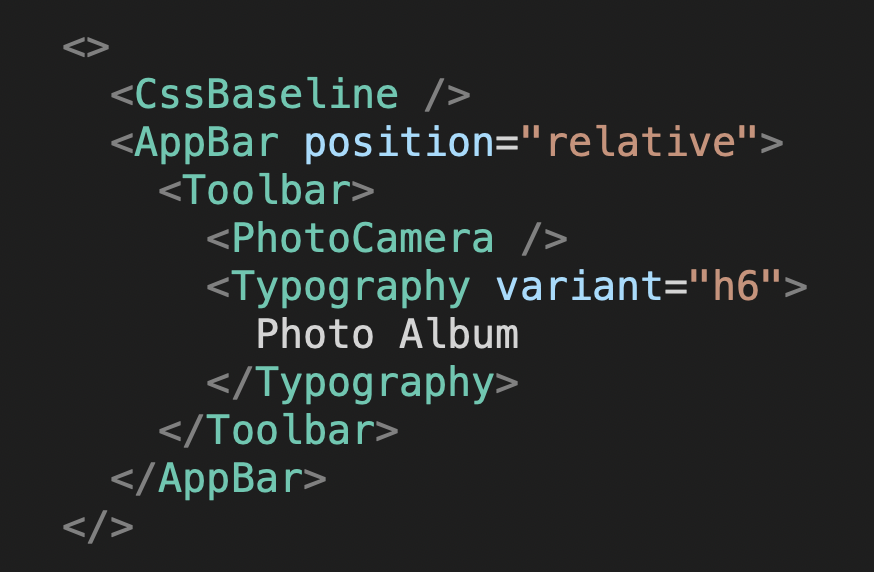
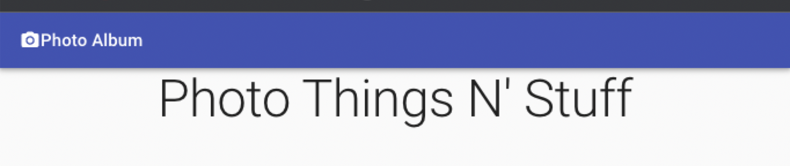
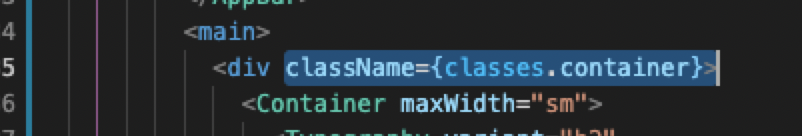
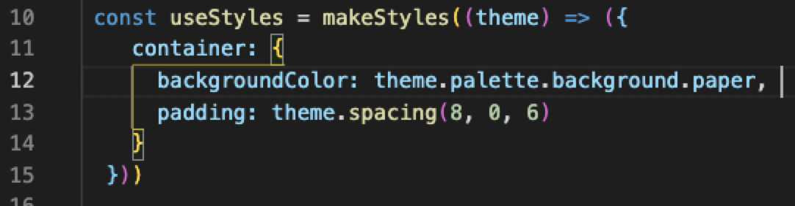
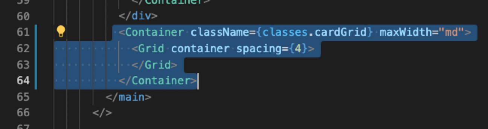
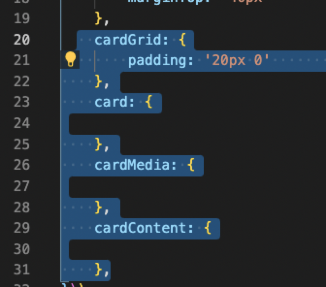
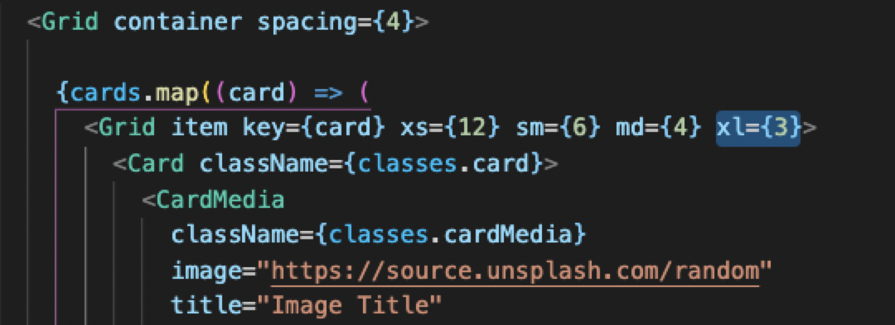
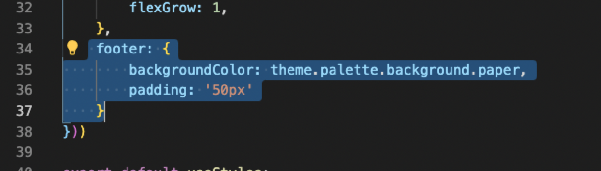

# 💻 Material UI crash course! 🖥️ 

####  **NOTES:** 
1. Not all of the following is copy/paste text. I personally feel that seeing the colors helps with association. Long, ridiculous stuff like a Google Font source WILL be copyable.
2. I am NOT a Material UI expert. I am, however, a better learner via text and visuals than I am via YouTube, and I wanted to piece this together for those of you who are more like me. While I did indeed apply my own personality and creative spin to many elements here, I used other sources such as various articles and YouTube videos. The _primary_ info source I used to put this tutorial together was a JavaScript Mastery video that can be found [HERE](https://youtu.be/Xoz31I1FuiY).
  

---
1. ## Spin it up (terminal):

        mkdir your-folder-name
        cd your-folder-name
        npx create-react-app your-app-name

This will put together the basics, but make sure your `index.js` is something like this:

 

---

2. ## Install these in terminal:

        npm install @material-ui/core @material-ui/icons

MUI uses "Robato". Type this into the head section of your index.html to source this font in from Google Fonts. I throw mine right above my title:

    <link                                                                   rel="stylesheet"                                                                      href="https://fonts.googleapis.com/css?family=Roboto:300,400,500,700&display=swap"                                  />                                                                                                                                

---
3. ## Fire the project up in terminal:

        npm start

---
4. ## In App.js, put together a dead simple page. Something like this would work:

 

---      
5. ## At the TOP of that component/App.js:

        import { Typography } from '@material-ui/core';

...you'll end up putting lots more fun stuff between those.

---
6. ## Now that that is there, put the following together and check out the BEFORE and AFTER:...

 

...these will producer similar things, but:

 

You'll see the MUI's Hello World! is a little wackier. Neat.

# We're going to build the "Album" template from scratch!

---
7. ## First on that - put AAAAALLL THIS STUFF in your import curlies up top next to Typography:

        import { Typography, AppBar, Card, CardActions, CardContent, CardMedia, CssBaseline, Grid, Toolbar, Container } from '@material-ui/core'; 

With that in mind, add this thing under that thing (it's a camera icon):

        import { PhotoCamera } from '@material-ui/icons';                

If you haven't looked at the icon options, check this out and prepare to be dazzled: https://mui.com/components/material-icons/

Yes, all of that is at your fingertips. Notice also the radio options on the left (outlined, etc)

Now that we're there, delete your dopey Hello World! thing and let's start making stuff. 

---
8. ## Throw in CssBaseline at the top of your component fire up a pretty baseline upon which to build.

 

---
9. ## Once you get that, take a deep breath, then throw ALL of this together…the tags should auto-populate closing tags and it’ll be very satisfying:

 

Go look at your project (did you run npm start in terminal?).

 

---
10. ## `main` indicates we're in the HTML things n' stuff...`Container` indicates we're in an MUI container (contains things in certain area of page). We're adding everything from the FIRST `<main>`:

 

NOTE: From this point in this tutorial, some blocks of what appear to be “code” will actually just be screenshots so we can focus on CHANGES with colors...like I mentioned earlier. Here’s an example, adding to what you see above...

---
11. ## Add a line of text!

 

Render...

 

---
12. ## Now let's add more Typography to act as an explainer, and let's challenge the format a little...

 

...on the dom ( I added he last sentence in the above code...yes, that was confusing 😄 ...sowwy!)

 

The goal here is to understand where these things are coming from...not to memorize.

---
13. ## On the [Material UI website](https://material.io/components), let's peep the left bar "Components and "Component API"...components contain examples and demos and crap:

 

Dig through these, learn, maybe copy some code and try some crap. It’s a sandbox.

---
14. ## Let's try a BUTTON GROUP...the `<` and `>` is the 'full source', so click that to compile the source and check it out. Copy the source code you need. In this case, figure out what you NEED…the imports at the top for sure (look at the matching names/categories), and then let’s use THIS to render *JUST BUTTONS TWO AND THREE*…

Here’s the full source on the page (you'll need to use the above link to find this yourself or type this all out):

 

Here’s what we’re actually going to put in our project (watch the colors and look for red error squiggles):

 

As always, when things get messy, `OPT + SHIFT + F` is your friend…try it out...

_NOTE: I got an error here (look at the imports)…all our imports have been from ‘@material-ui/core’ or similar…so I changed them AND IT WORKED…_ 

 

Sometimes you just gotta mess around with stuff...it worked. Feels good, right?

 

MOVIN' RIGHT ALONG...

Here’s a cool way to do a quick style job if you want to see something in action…just follow this syntax. In this case, I quickly made the backgroundColor of button two “pink” (quotes are necessary).

 

...or huge:

 

---
15. ## Time to make another div and grid some stuff...

 

(Sorry, yes, we got rid of our huge/pink button)

 

---
16. ## Copy that stuff and add ANOTHER grid item and button (with a carefully placed screenshot):

 

I'm realizing now that I spelled spacing wrong (and it didn't break the app...weird)

## FUN FACT!!! ALL OF THIS IS RESPONSIVE...

 

And now...we STYLE with MUI recommended styling...

---
17. ## Import this at the top and start up a hook:

 

This is gonna pass in a callback function that contains an object which has all our gosh dang styles!

---
18. ## Now go name a div with an object `classes` and add property `.CLASSNAMEHERE` (replace with the class name of your choice). In this case, I’ll do container.

 

---
19. ## Go back up to that callback function and get to work making things look neat...

 

---
20. ## Here’s the part that requires some trial and error and playing around……MUI operates on an 8px default with its spacing. You can alternatively just say things like “20” for 20px.

 

---
21. ## Export/import time! We are going to get it off the main page. Make a `styles.js` file in the same directory, then copy that syntax (and the import from MUI). Move all the syntax over there and `export` it at the bottom:

 

...yes, I have a huge ridiculous note-to-self and, yes, I know how to spell immediately. I promise.

---
22. ## Add some classes by section on your App.js page like this:

 

---
23. ## Over in `styles.js`, we're going ot add those styles (you can simply add new objects to the chunks of code):

 

---
24. ## Now you can actually add styles. Keep in. Mind that this syntax is different than CSS - you’ll need to wrap styles in quotes:

 

---
25. ## Let’s add a container at the bottom for our CARDS…here’s the starting code. `“md”` stands for medium, in this case.

 

---
26. ## Add all this neat stuff. The image link is an Unsplash random image generator and will fire off a new image on every reload:

 

---
27. ## Let's add some text and buttons!

 

You'll see there's no image. In this case, we need to give it a HEIGHT. Yes. A height. 

 

---
28. ## We need to add classes. Remember, we added a bunch over on `App.js`:

 

---
29. ## Let’s take it over to our styles.js and do some crap! Please also note that the `20px 0` means that it’ll ave 20px padding TOP AND BOTTOM and 0 LEFT AND RIGHT. 

 

---
30. ## And here are some specific styling thingies:

 

_**FUN FACT: 56.25% isn't random. That means it'll have an aspect ratio of 16:9.**_

Check out the card...

 

---
31. ## Now we want a bunch of cards...yes, we could copy that big blob of code a bunch of times...nope, LET'S `MAP` IT! Start with this at the top:

 

---
32. ## Fire up a JSX logic block like this (with a callback function with instant return)…don’t sweat the red squiggle…it’s because it’s empty...FOR NOW...

 

---
33. ## Copy the whole grid item:

 

---
34. ## ...and put it inside the map loop:

 

---
35. ## When you map over something, you must provide a key. in this case, we'll just use card.

 

---
36. ## SIZING STUFF!! We need to specify how much horizontal space each card will take on a device. On mobile devices, we want to take the ***full width*** - <u>the full width is `12 spaces` ON ANY GIVEN DEVICE</u>…I don't know a ton about this stuff yet, but this kind of seems like the very essence of Material UI. In this case, we're gonna do an `xs` device and take up the WHOLE THING (because the cards will otherwise be too small):

 

Here it is on an iPhone:

 

Neat!

---
37. ## Now we add another for a slightly larger device like an iPad (taking up 6 spaces = taking up HALF the device):

 

It looks like this:

 

---
38. ## For MEDIUM devices:

 

...such as an iPad Pro (and I don't know why the Google preview didn't show the device frame for this).

 

---
39. ## And here's an xl for a Mac:

 

It shows up like this (I had to zoom out):

 

NOTE: you can also do `lg`...I tried it after the fact. I set one to `{2}` and it was a six-wide card setup when I made it HUGE...

---
40. ## That's the bulk! Now let's do a quick footer demo:

 

---
41. ## Throw it in the style page:

 

---
42. ## And, finally, the content as follows. Two rows of Typography. First is a footer title of sorts, and the second is, as you can see, `color=“textSecondary”`:

 

Here's how that appears:

 

# _***WE DID IT!!***_ 

Check out the responsive nature of this thang, y'all...

 

I SINCERELY hope this helps some folks. Please don't hesitate to reach out to me if you have questions (or if you find any errors in the above 😃)

# _HAPPY HACKING!_

 

_[My Twitter (@HolyMosesMusic)](https://twitter.com/holymosesmusic)_  
_[My GitHub](https://github.com/chrismochinski)_  
_[My LinkedIn](https://www.linkedin.com/in/chrismochinski/)_ 
