# <b>REACT REDUX...</b>
## ...and how I used it with `useSound` on my personal landing page!
---
I decided I want to implement the <b>_useSound_</b> hook on my personal landing page. The goal was an `onMouseDown` "click!" and an `onMouseUp` "WHOOSH!" whenever page navigation occurred (in conjunction with React Scroll - it's pretty neato, the sounds are home-made in Logic Pro X, and it'll be [HERE](https://chrismochinski.com) when it's done. If you're interested in this feature, send me a message or check out the [use-sound docs](https://www.joshwcomeau.com/react/announcing-use-sound-react-hook/) c/o [Josh Comeau](https://github.com/joshwcomeau).

ANYDANGWAY - because my site is responsive, I have a top navbar as well as a SIDE navbar (hamburger). These are separate components. I want to include a little speaker icon on my top navbar (which is visible on all screens), and _**I need the vol/mute state to be shared with all components**_. ENTER...[REDUX](https://www.npmjs.com/package/redux). 

 

## DESKTOP:
 

## MOBILE/IPAD:
 

#### Notice the little speaker icon in the top left corner in EACH VIEW? That switches the state - <b>sound on / sound off</b>. I need that state in  more than one component. Party. 

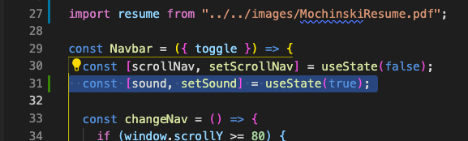 

---

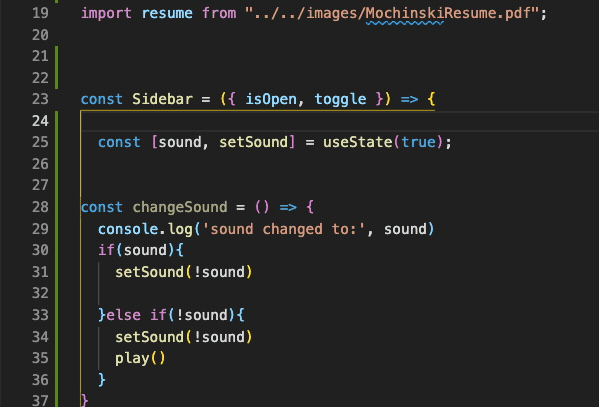 

<b>NOTE:</b> No [saga](https://www.npmjs.com/package/redux-saga) with this one, friends (since, for now, we're just sharing ONE BOOLEAN VALUE). Keepin' it simple.

# _Here we go!..._
---
---

## 1. Install stuff.
        npm i redux react-redux
##### _the `react-redux` is to bind the two...or something like that...just trust me_ 😃

---

## 2. I always watch my `package.json` while things install...

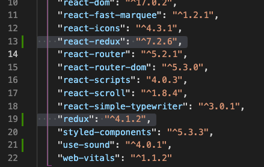 

---

# Time to set up Redux.

Remember - this project already exists and is essentially done. I'm just adding Redux so I can send the muted/audio on state (boolean) to another component. Is there any easier way to do this? Probably. Do I know it? Probably. Does this way sound more educational for me? Probably. Am I going to go upstairs and make a slab of toast with a lethal amount of peanut butter on it when I'm done here? Probably.

## 3. Imports

Bring `Provider` and `createStore` into your `index.js` file like this:

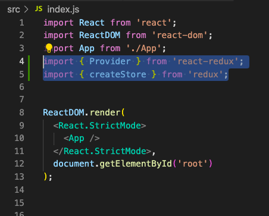 

## 4. Same file, add this stuff:

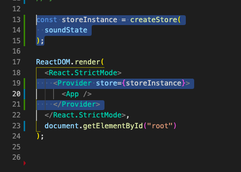  
This will wrap your component in the "Provider" that "provides" the store. Blam. 
Also `soundState` is the name of my reducer. You should call this whatever you want. Try to make it descriptive of what you're trying to accomplish.
You're going to get an error right now. Worry not! Proceed...

---

## 5. Set up your dispatch

It's up to you how you want to proceed here, but I'm going to head to the client-facing component and follow the path of the data/state from there. To the NAVBAR now...we import! 

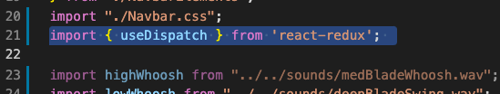
 
  

### _While we're at it, throw this in right under the function component:_ 

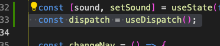   

MAKE NO MISTAKE - from there, there are several ways to do things. There are probably several EASIER ways to do them, even. This is how I chose to put this together...

---

## 6. Sending the boolean value via a dispatch

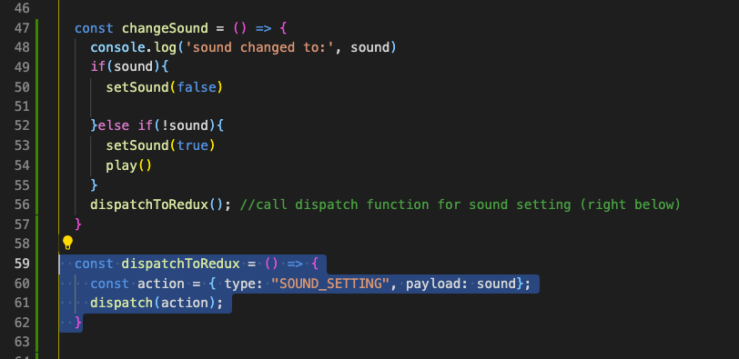   

Notice the top function - that's what is called when the user clicks the little speaker (it toggles sound on / mute). Simply put - it becomes true if false and false if true (in this case, TRUE means MUTED, by the way...).

At the end of that function, we jump into the `dispatchToRedux` function. We are going to set a TYPE (the chosen naming convention "IS_PRETTY_STANDARD"). Basically, that dispatch is going to search for a matching type and send the payload. In this case, the payload is a boolean value...whatever came from the previous function 👍

Now let's follow that dispatch back over to `index.js` and add the recipient (reducer)...

---

## 7. The Reducer

Because this is the last screengrab (and step) in `index.js`, here's the full page of code:

   

We're now setting up a listener that is going to receive that type that was called from the navbar component - "SOUND_SETTING". It's also getting the payload - a boolean value. This value is being changed in the function on the navbar component, but we need to change it in this little Redux store - a storage unit that kind of acts as a cloud that can serve up data to any of your components. 

There are all kinds of rules about 'mutating state' and, in this case, I'm getting a little weird with it. I hope that's okay! It certainly seems to work...

NOW WE DELIVER THE GOODS VIA:

---

## 8. useSelector

This is how we GET the info on another page. Import at the top:

   

...and this under the function component which, in this case, is bringing in the WHOLE store and assigning it to the word `sound`. No bigs in this case - it's just a boolean value:

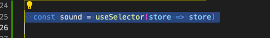   

I used the same variable name on this sidebar component as I did over on the navbar component so I can copy all the other functional syntax. Like this stuff:

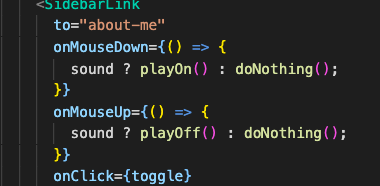   

...which call these cool `useSound` functions up above:  

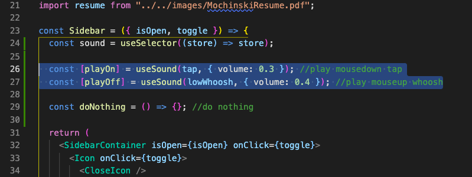   

## 9. But wait...what about the FOOTER!?

Whoopsie doodle - I have a footer component with these buttons as well. Let's throw it in there too!!

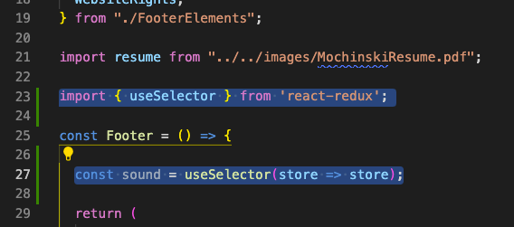   

## 10. Aaaaand implement!

Now that it's imported, we can copy the functions and useSound stuff exactly.

## Check it out HERE: [chrismochinski.com](https://chrismochinski.com)

---

I SINCERELY hope this helps some folks. Please don't hesitate to reach out to me if you have questions (or if you find any errors in the above 😃 )

# _HAPPY HACKING!_

 

_[My Twitter (@HolyMosesMusic)](https://twitter.com/holymosesmusic)_  
_[My GitHub](https://github.com/chrismochinski)_  
_[My LinkedIn](https://www.linkedin.com/in/chrismochinski/)_ 
