# REACT ROUTERS (v5)
  
#### _This is currently the day-one doc for v5 based on Matt's lecture_
---
### UPDATE (11/29/21) - React Router V6 changes some stuff here (but much is still similar). `Switch` is no longer used and has been replaced by `Routes`. I'll update this to V6 soon and will remove this message when I do!
---

1. ### STARTUP

## - _fork as usual_
## - _clone as usual_
 

### - IF NO SERVER:

        npm start
### - IF *YES* SERVER...

        npm install

### - Open TWO terminal tabs and run each of these (keep them running):

        npm run server

        npm run client

### ...Go Look at your package.json...

 
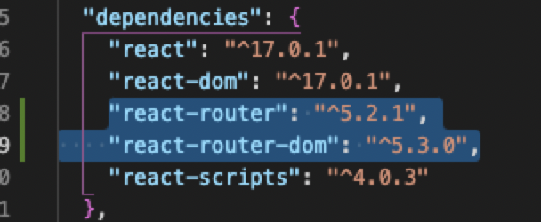 

2. ## Add this import line on your main page (_likely App.js_):

 

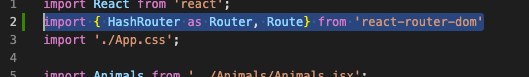

 

#### ...which loosely translates to "import hash router, but let's rename is Router (and Route)" 

3. ## now add these < Router> and </ Router> lines around your crap (don't forget your </Components!>):
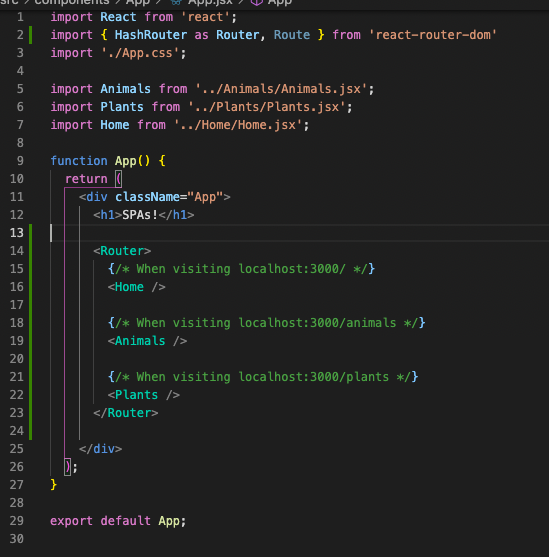 

4. ## If you want to associate things with "A ROUTE", you must wrap it in a route like THIS:

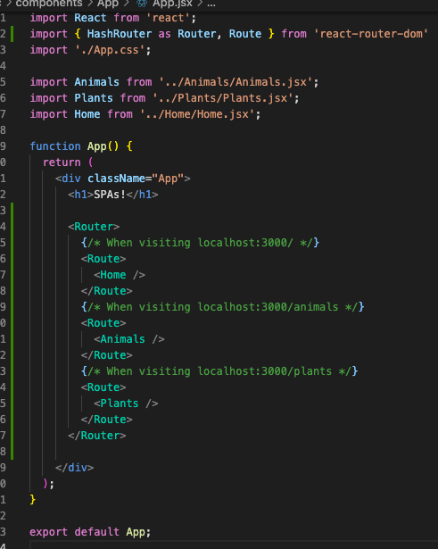 

5. ## Give your path properties like this (and things will subsequently disappear on the DOM...which is okay):
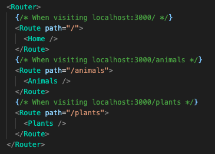 

6. ## Check for this stuff on the DOM:
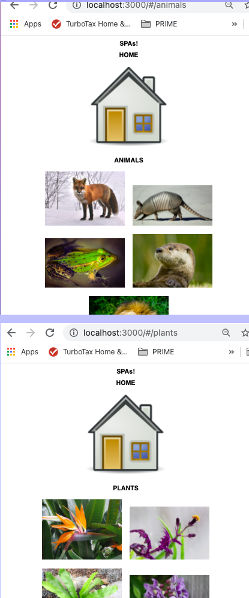 

7. ## Add EXACT like this...it'll clean things up and get rid of stuff that is appearing on every page:
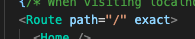 

8. ## Now throw the page linkes inside their router path:
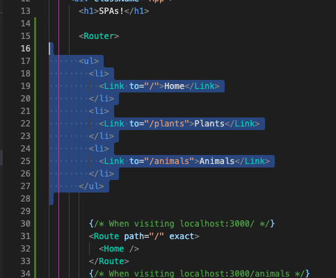 

9. ## ...and add Link here:
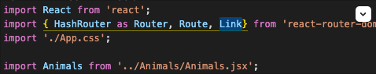 

10. ## BOOM...SPA success. Now, lets put a BUTTON on the Animals component that will take us to the plants route:
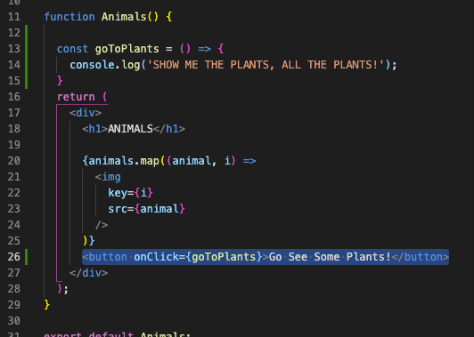 

11. ## ...and an associated function up above the return:
:
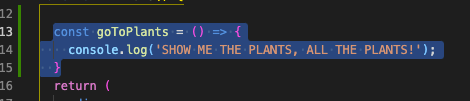 

12. ## Here's how it works - the PUSH function puts it into the "array" (sort of) and the last item in the array is what will render. 
 

### ...Thus - whatever you push, you go there. I think. Kinda. More on this later... 
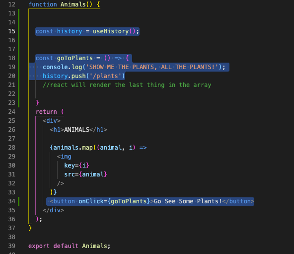 