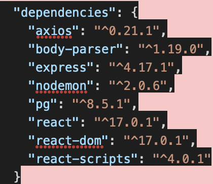
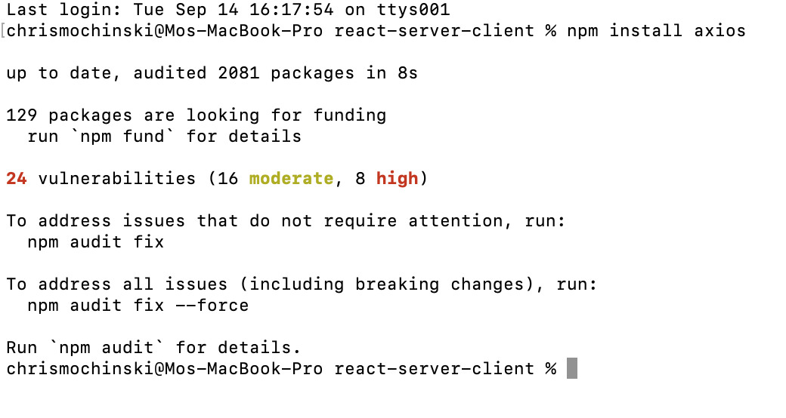
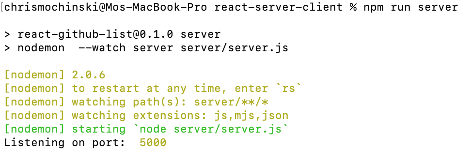
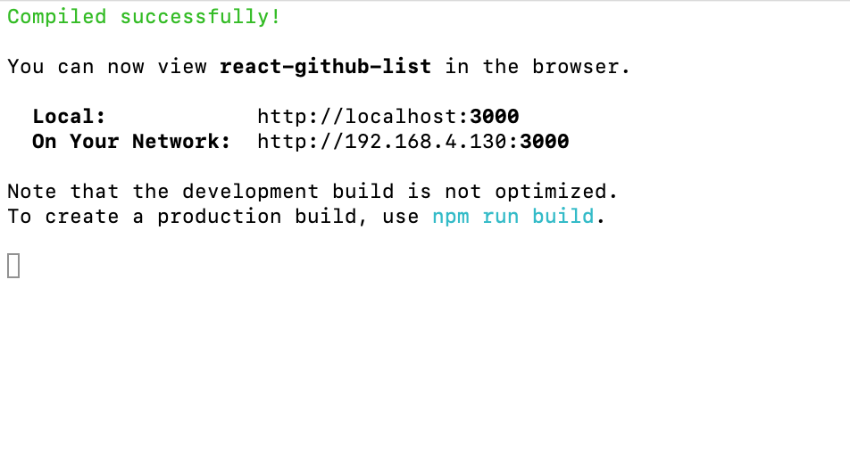

# REACT - EARLY STAGES!!
  
#### _this doc is subject to change...it's only day TWO..._
---
### The PURPOSE of this is twofold. 1. Clarity in general, and 2. To make pair/group programming a little easier and cleaner, no merge conflicts, etc. 
 
---

1. ### TERMINAL THINGS:

##### - _fork as usual_
##### - _clone as usual_
# -      
        npm install
#### - _check your package.json...if you don't see, axios like here..._

 
 

##### - _then do_ 

        npm install axios

#### You'll see something like this:

 
 

---
## STARTING YOUR SERVER: 
 

#### You'll actually need THREE terminal tabs...

### _TAB 1 --- type..._

        npm run server

#### _this will run on PORT 5000_

 
 

 

### _TAB 2 --- type..._

        npm run client

#### _this will run on PORT 3000...the RESULT will take a minute and do some stuff and then look like this:_
 
 

 

### _TAB 3 --- just get yor file root ready for adds/commits/pushes_ 
 

### ...NOW YOU'RE READY TO PARTY
---

# 2. SETTING UP VS CODE...

