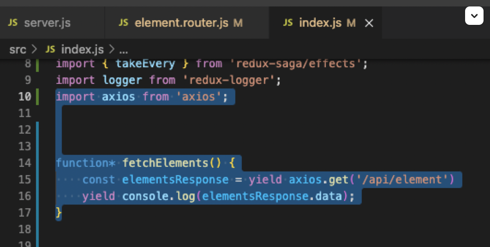

# **REDUX SAGAS DAY 1!**
  
##### _this doc is subject to change...it's only DAY ONE..._
---
## Sagas make it so we can be a little lazier.

Generally, if you're  SWITCHING to sagas, the only place we need to go is index.js and app.jsx (reducer land) OR THE COMPONENT (where reducers are called)

To start, MAKE SURE IT IS SET UP AS THUS so your central saga function cooperates:

---
 

# ***LET'S PARTY!***

## - _fork as usual_
## - _clone as usual_
 

        npm install

### - Open TWO terminal tabs and run each of these (keep them running):

        npm run server

        npm run client

---

1. Make sure things are set up like THIS (toward the end of the index.js file) or it'll break:

 

 

#### _…...and then your..*ahem*...sagaMiddleware Entrypoint...where all your watchers will go (closer to top of your index.js file):_
 

 

2. ## Import!:
 

3. ## Inside that watcher from step 1, throw a takeEvery function in (that'll watch for a call):
 

4. ## And add a function in the same file, with a console.log to test, as thus:

 

 

5. ## Add the appropriate, corresponding TYPE over in your component to call that one...

 

## _…it's like a shortcut in reducer world!!!_

 
 

6. ## so THIS...

  

## BECOMES:

 

7. ## And here is the index.js side (don't miss the import...):

 
 

8. ## Then put this 'put' method hre in the import (not a traditional put):
 
 

9. ## ...and then, instead of DISPATCH...you use put (like imported):
 

## _...don't forget the .data that grabs that property SPECIFICALLY...the whole thing will be a mess of stuff in the console...this may take a little trial and error_
 

10. ## Now - ERROR CATCHIG! The 'try catch':
 
 

## SAGAS/YIELD EXPLANATION:

_Sagas is helpful for complex situations and asynchronous requests. There are extra things…like “forking” and “taking”…we are using “takeEvery”. The “put” function expects a “yield” because, under the hood, it schedules that “put” to happen. The “dispatch” sounds pretty synchronous._

### Now we post!!!!!
 

11. ## From app.js side:
 
 

12. ## Index.js side starting out:
 
 

_...the "action" argument we sent over is BOTH TYPE AND PAYLOAD...you need to do act4ion.type and/or action.payload to specify_

 

13. ## THEN WE MAKE THE ACTION/PAYLOAD STUFF HAPPEN!!! Sorry for the all caps. Too lazy to delete.
 
 

/////////////////////////////////////////
/////////not done

14. ## Then put this 'put' method hre in the import (not a traditional put):
 
 

15. ## Then put this 'put' method hre in the import (not a traditional put):
 
 

16. ## Then put this 'put' method hre in the import (not a traditional put):
 
 

