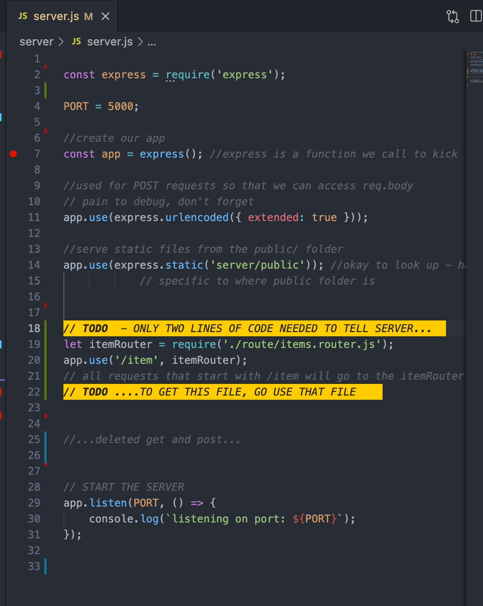

# ROUTES AND ROUTERS

#### _this doc is subject to change...it's only day one_
---
### The PURPOSE of this is twofold. 1. Clarity in general, and 2. To make pair/group programming a little easier and cleaner, no merge conflicts, etc. 
 
---

1. ### In your project folder, create a NEW folder in the server directory called "routes"

 
 
 
---
 

2. ### Make a file for your new route INSIDE that folder - name it: FILENAME.router.js (replace FILENAME with whatever your /subdirectory is called to keep it simple). You may have to do this for several routes if applicable...
   

    

It'll now look something like this /\ /\  

 

---

 

3. ## There's a NEW line you have to put into express (see line 4...line 3 should already be there):
   
 

---

4. ## This line goes at the bottom of your router to export:
  

---

5. ## Move any necessary variables into the route folder...did you need an array or something? Put it where it needs to go now.

----

5. ## All your GET/POST/DELETE ets? Those WHOLE functions come out. Put them IN YOUR ROUTER now (and change the app.get to router.get...same with router.post, etc). You will also REMOVE THE URL...UNLESS IT'S ONE MORE EXTESION DEEP. Check this out in this screenshot, and notice the listOfItems array is now in the router:

  

---
 

6. ## After full cleanup, your server should look like THIS. You can disregard my crazy bright highlighter extension...it is pretty awesome, though.
 

  

---