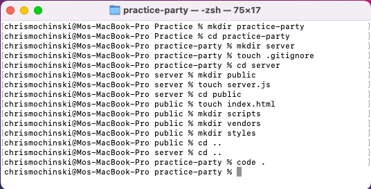
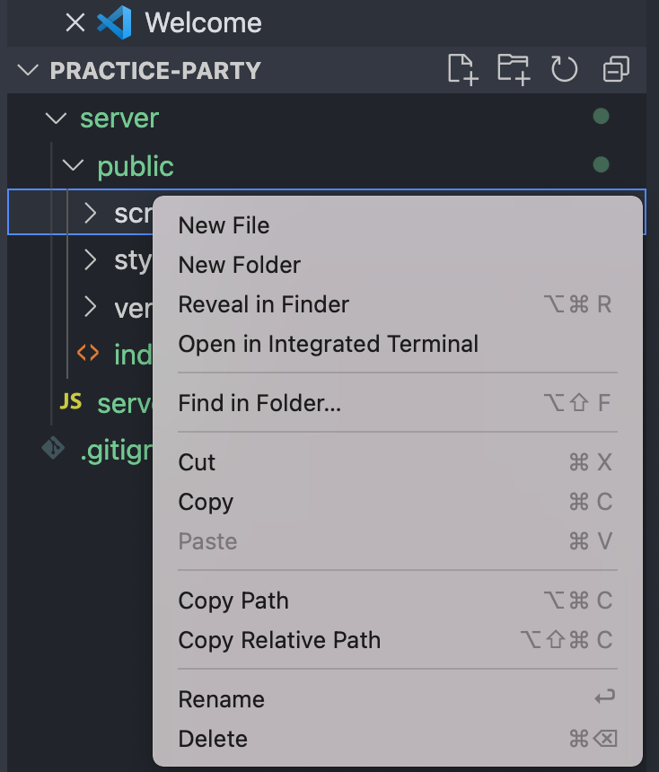
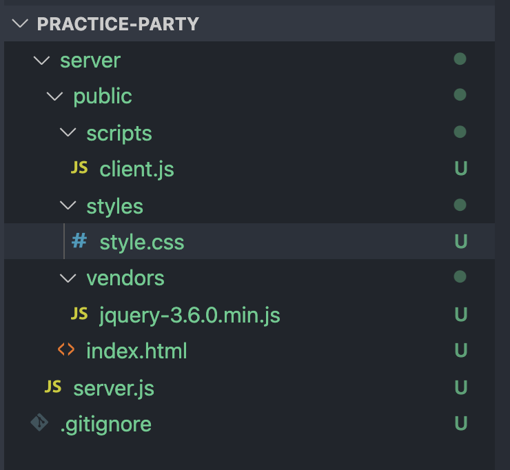
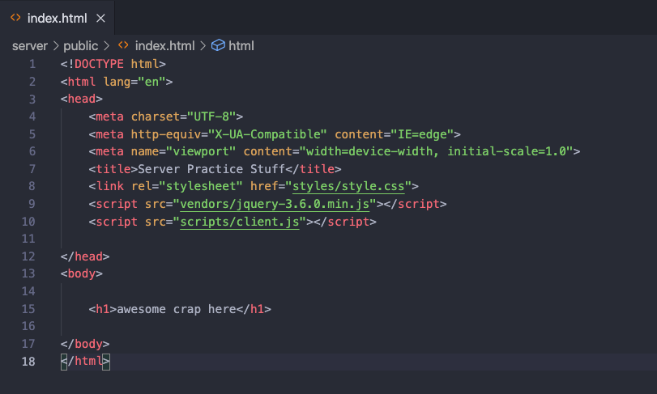
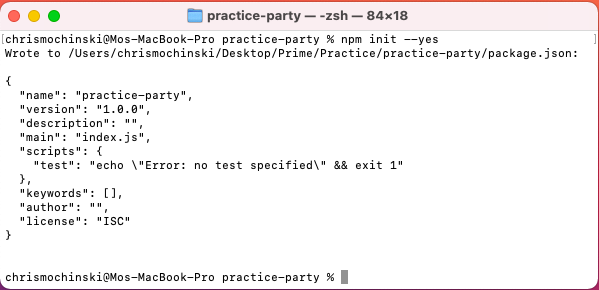
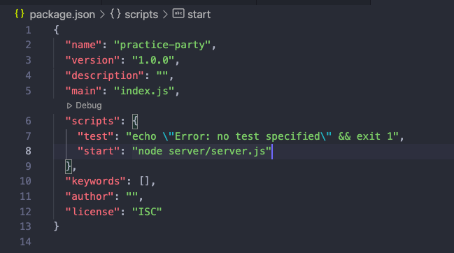
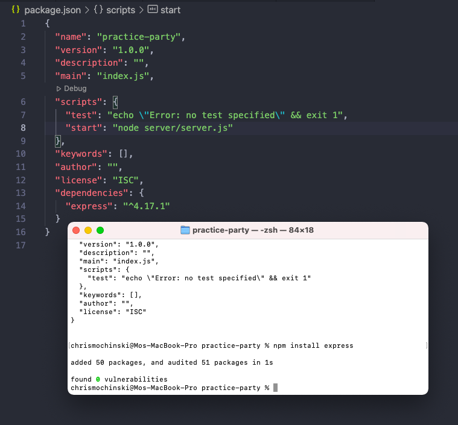
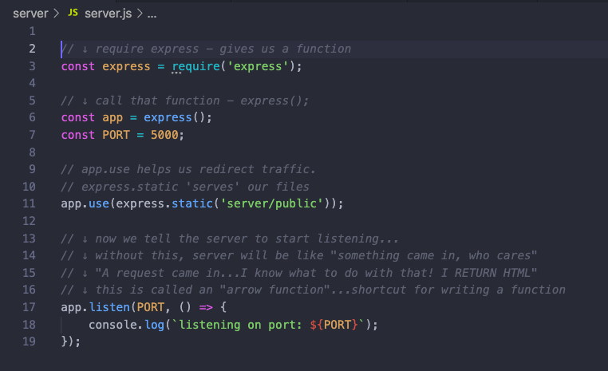
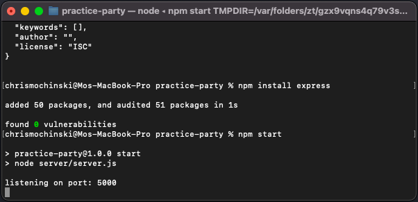
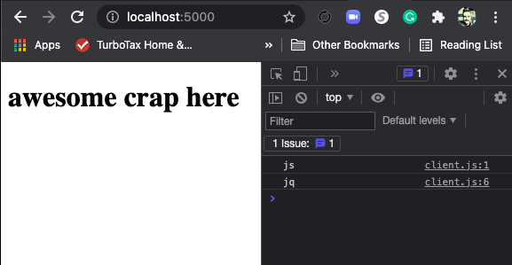

# HERE'S HOW WE DO THIS SERVER THINGY
---
1. ## Open terminal and pick your destination directory. Then do aaaaaallll this stuff (see image):

    - mkdir ***name-of-directory*** --- (making the file you're gonna do stuff in)
    - cd ***name-of-directory*** --- (to go into it)
    - mkdir ***server*** --- (a nice new server folder)
    - touch ***.gitignore*** --- (blocks some crap from some crap)
    - cd ***server*** --- (changes your working directory to this)
    - mkdir ***public*** --- (public folder)
    - touch ***server.js*** --- (a file of important javascrip things n' stuff)
    - cd ***public*** --- (move into the public directory)
    - touch ***index.html*** --- (here's your main html page!)
    - mkdir ***scripts*** --- (here's a folder for your javascript you'll source)
    - mkdir ***vendors*** --- (here's a folder for jQuery)
    - mkdir ***styles*** --- (and, finally, a folder for your CSS )
    - cd .. --- (goes up one level)
    - cd .. --- (you've now gone UP two levels)
    - ***code .*** --- (open all that stuff up in VS Code!)  

    
 

---

2. ## Go into your new VS Code window and add...
    - ***style.css*** to your styles directory
    - ***client.js*** to your scripts directory
    - ***jQuery*** (wherever you paste it from) into your vendors directory  

     

    ## ...it'll now look something like this: 

     

    ---

3. ## Do your HTML boilerplate, source your CSS/JS/JQ and make an H1 with something awesome in it. BE CAREFUL HOW/WHERE YOU SOURCE. Here is a screen grab of my FINAL HTML:
 

 

---

4. ## Get your butt back over to Terminal and enter: 
    - ***npm init --yes***   
    - this initializes your PACKAGE JSON
    - the --yes answers YES to all questions (a few will come in if you don't include this) 

    ### this is what will appear:   
 

---

## You SUDDENTLY have a file called **package.json** in your little tree on the left in VS Code!! Open 'er up. 
    
---

5. ## After the line that starts with "test", type a comma. Then, hit enter and, on the nexts line, type the following:
    ## ***"start": "node server/server.js"***    

   

---

6. ## Back in TERMINAL, type the following:  
***npm install express***.    
    This will do some stuff to your tree and will drop a version at the bottom of your package.json file (mine says some crap ending with **"express": "^4.17.1"**). 

   

---

7. ## Good luck memorizing THIS stuff...
    Go to your server.js and type all of this (and feel free to disregard my clumsy comments) ... 

   

---

8. ## in your .gitignore file, type this:

node_modules/  
.DS_Store

---

9. ## MOMENT OF TRUTH...in Terminal, type:
 

# ***npm start***

   

# The above is what you should see in terminal after you press ENTER...

---

10. # And here is what you should see in your index.html with the above steps - 

  

---

## and, finally, in the browser when you enter ***localhost:5000***   

  

---
---

# DAY TWO !!!

 
 

This one

    
